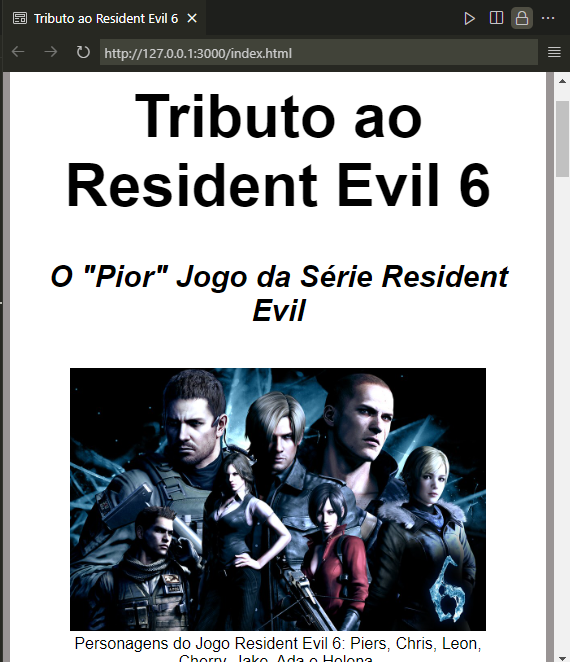

# Tributo Resident Evil 6 Static Page

Este é um projeto de página estática desenvolvido com HTML e CSS, criado como um tributo ao jogo Resident Evil 6.

## Descrição

Este projeto consiste em uma página web simples que homenageia o jogo Resident Evil 6. A página inclui informações sobre o jogo, imagens e estilos inspirados na estética e atmosfera do universo de Resident Evil.

## Estrutura do Projeto

O projeto está estruturado da seguinte forma:

- `index.html`: Arquivo HTML principal que contém a estrutura da página.
- `styles.css`: Arquivo CSS para estilizar a página e aplicar a aparência desejada.

## Tecnologias Utilizadas

- HTML5
- CSS3

## Como Visualizar

Para visualizar o projeto localmente:

1. Clone este repositório: `git clone https://github.com/seu-usuario/Tributo-Resident-Evil-6-Static-Page.git`
2. Abra o arquivo `index.html` em um navegador web.

## Screenshots

## Contribuições

Contribuições são bem-vindas! Se você deseja melhorar este projeto, sinta-se à vontade para fazer um fork e enviar um pull request.

## Licença

Este projeto está licenciado sob a MIT License - veja o arquivo [LICENSE](LICENSE) para mais detalhes.
